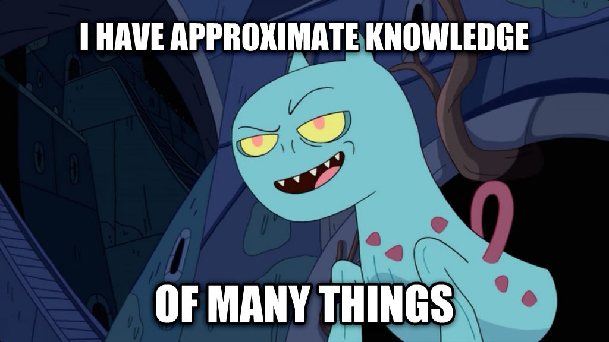

### Vladimir Alyamkin

``` > Making games with Unreal Engine ```

Jack-of-all-trades with more than a decade of Unreal Engine experience, noted by Epic Games with Lifetime Contribution Award 2018. Years of experience in managing teams and building products up to million DAU.



In love with open source. Open for creative collaboration on promising projects.

* [Public Talks](/public-talks)
* [My Projects](https://www.artstation.com/alyamkin)
* [UE4 Marketplace](https://www.unrealengine.com/marketplace/en-US/profile/Vladimir+Alyamkin)

Connect with me:
* [Github](https://github.com/ufna)
* [Telegram](https://t.me/ufnadev)
* [Habr](https://habr.com/ru/users/ufna/posts/)
* [LinkedIn](https://www.linkedin.com/in/alyamkin/)

You have an excellent idea? Hit me.

